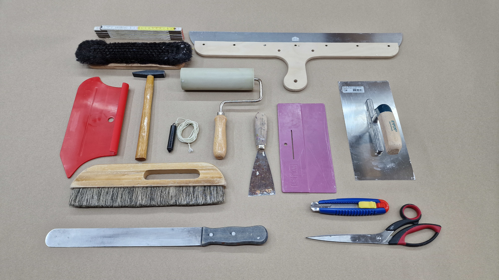

<!--

author:   DiAgnostiK-Coach
email:    info@gkz-ev.de
version:  0.1.0
language: de
narrator: Deutsch Male

edit: https://github.dev/Ifi-DiAgnostiK-Project/Malerhandwerk/blob/main/materials/maler_tapezierwerkzeuge_lektion.md
date: 2026-04-27

icon: ../assets/img/Logo_234px.png
logo: ../assets/img/maler_werkzeug_tapetenkurs.jpg

attribute: Logo-Bild: HWK Dresden, Florian Riefling

comment:  Lerneinheit – Tapezierwerkzeuge: Überblick über alle wichtigen Werkzeuge für das Tapezieren

title: Tapezierwerkzeuge – Was brauche ich zum Tapezieren?

tags:   Maler,
        Lackierer,
        Raumausstatter,
        Tapezieren,
        Tapezierwerkzeuge,
        Werkzeuge,
        Grundlagen

link: ./style.css

import: https://raw.githubusercontent.com/Ifi-DiAgnostiK-Project/Piktogramme/refs/heads/main/makros.md
        https://raw.githubusercontent.com/Ifi-DiAgnostiK-Project/Bildersammlung/refs/heads/main/makros.md

-->

# Tapezierwerkzeuge – Was brauche ich zum Tapezieren? 🖌️

Tapezieren klingt einfacher als es ist — wenn man nicht weiß, welches Werkzeug wofür da ist.
Ein falsches Werkzeug führt zu schlechten Nähten, Luftblasen oder beschädigten Tapeten.

<!-- class="highlight" -->
In dieser Lerneinheit lernen Sie alle wichtigen Tapezierwerkzeuge kennen: was sie heißen, was sie können — und was man mit ihnen **nicht** tun sollte.

 

<!-- style="max-width: 550px; width: 100%" -->

## Vorbereitung: Messen und Markieren

    --{{0}}--
Bevor eine einzige Tapetenbahn an die Wand geht, kommt die Vorbereitung. Messen, anzeichnen, lot- und waagrecht ausrichten. Dafür brauchen Sie zwei Werkzeuge, die eigentlich jeder kennt — aber deren genaue Funktion beim Tapezieren nicht immer klar ist.

### Werkzeuge zum Messen und Ausrichten

| Werkzeug | Verwendung beim Tapezieren |
|----------|--------------------------|
| **Gliedermaßstab / Zollstock** | Raummaße nehmen, Tapetenbahnen abmessen und auf dem Tapeziertisch ablängen |
| **Senklot / Lot** | Senkrechte Linie an der Wand anzeichnen — damit die erste Bahn exakt gerade hängt |
| **Wasserwaage** | Waagrechte Linien kontrollieren, besonders an Deckenanschlüssen |

<!-- class="box" -->
**Merksatz:** Das Senklot wird **nicht** zum Zuschneiden verwendet. Es zeigt die exakte Senkrechte an der Wand — die Basis für gerades Tapezieren.

    --{{1}}--
Die erste Tapetenbahn bestimmt alles. Wenn sie auch nur leicht schief hängt, addiert sich der Fehler mit jeder weiteren Bahn. Das Senklot gibt Ihnen die genaue Senkrechte — immer. Und der Gliedermaßstab ist das erste, was Sie in die Hand nehmen: Raum ausmessen, Bahnlänge berechnen, zuschneiden.

      {{1}}
> **In der Praxis:** Zeichnen Sie vor der ersten Bahn immer eine senkrechte Linie mit dem Senklot an die Wand. Diese Linie ist Ihr Orientierungspunkt für den gesamten Raum.

## Zuschneiden: Tapetenbahnen auf Maß bringen

    --{{0}}--
Tapetenbahnen müssen präzise zugeschnitten werden — sonst passt die Naht nicht, der Rapport stimmt nicht, oder Sie verschwenden Material. Das Zuschneiden geschieht auf dem Tapeziertisch, mit Cuttermesser oder Tapezierschere.

### Werkzeuge zum Zuschneiden

| Werkzeug | Verwendung |
|----------|-----------|
| **Cuttermesser** | Gerades Zuschneiden von Tapetenbahnen auf dem Tapeziertisch, saubere Schnitte an Ecken und Leisten |
| **Tapezierschere** | Kürzen von Bahnen, Einschnitte an Ecken und Steckdosen — großes, langes Blatt für gerade Schnitte |
| **Gleitfußmesser** | Speziell für den Doppelnahtschnitt bei Vliestapeten (durch zwei Lagen schneiden) |

<!-- class="box" -->
**Merksatz:** Cuttermesser und Tapezierschere ergänzen sich. Das Cuttermesser für Geradschnitte auf dem Tisch — die Schere für Anpassungen an der Wand.

    --{{1}}--
Ein häufiger Fehler: Die Schere wird auf dem Tapeziertisch eingesetzt, das Cuttermesser an der Wand. Es funktioniert auch umgekehrt — aber es ist unkomfortabler und ungenauer. Nutzen Sie das Werkzeug dort, wo es seinen Stärken entspricht.

      {{1}}
> **In der Praxis:** Für saubere Schnitte am Decken- und Sockelanschluss bewährt sich das Cuttermesser mit einem Spachtel als Führungsschiene.

## Kleister auftragen: gleichmäßig und vollständig

    --{{0}}--
Ob die Tapete hält, entscheidet sich beim Kleistern. Der Kleister muss gleichmäßig und vollständig aufgetragen werden — kein Rand darf trocken bleiben. Dafür gibt es spezielle Werkzeuge.

### Werkzeuge zum Kleistern

| Werkzeug | Verwendung |
|----------|-----------|
| **Kleisterbürste / Tapetenbürste** (groß, weich) | Kleister vollflächig und gleichmäßig auf die Tapetenbahn auftragen |
| **Kleistergerät / Kleistermaschine** | Automatisches Einkleistern von Tapetenbahnen — gleichmäßiger Auftrag, zeitsparend bei größeren Aufträgen |
| **Farbroller (Kurzflor, Kunstfaser)** | Kleister bei der Wandklebetechnik (Vliestapete) direkt auf die Wand auftragen |

<!-- class="box" -->
**Merksatz:** Bei **Vliestapeten** wird der Kleister an die **Wand** gestrichen — nicht auf die Tapete. Dafür eignet sich ein Farbroller aus Kunstfasern besser als ein Pinsel, weil er gleichmäßiger aufträgt.

    --{{1}}--
Hier liegt ein typischer Unterschied: Papiertapeten → Kleister auf die Tapete. Vliestapeten → Kleister an die Wand. Das klingt wie ein Detail, macht aber in der Praxis einen großen Unterschied für das Ergebnis.

      {{1}}
> **In der Praxis:** Wenn Sie Kleister auf eine Vliestapete auftragen, saugt das Material zu schnell und quillt ungleichmäßig. Wandklebetechnik ist hier die richtige Methode.

## Andrücken und Glätten: sauber verarbeiten

    --{{0}}--
Die Tapete hängt an der Wand — jetzt müssen Luftblasen und Falten heraus. Das Glätten ist eine eigene Disziplin. Falsch gemacht entstehen Blasen, die erst nach dem Trocknen sichtbar werden.

### Werkzeuge zum Andrücken

| Werkzeug | Verwendung |
|----------|-----------|
| **Tapezierbürste** (breit, flach, lange Borsten) | Tapetenbahn nach dem Anbringen von der Mitte nach außen ausstreichen — Luft herausdrücken |
| **Andrückwalze / Nahtrolle** | Nähte zwischen zwei Bahnen sauber andrücken |
| **Andrückspachtel** | Tapete an Kanten, Ecken und hinter Heizkörpern andrücken — besonders bei strapazierfähigen Tapeten wie Glasgewebe oder Vliestapete |
| **Perforationswalze / Igelwalze** | Alte Tapeten durchlöchern, damit Tapetenlöser besser eindringen kann — Einsatz beim Tapeten**entfernen** |

<!-- class="box" -->
**Merksatz:** Die Perforationswalze / Igelwalze wird zum **Entfernen** von Tapeten eingesetzt — nicht zum Andrücken neuer Tapeten.

    --{{1}}--
Das ist ein häufiger Verwechsler: Die Igelwalze sieht aus wie ein Werkzeug zum Andrücken — ist es aber nicht. Die Spitzen durchstechen die alte Tapetenbahn, damit der Tapetenlöser einziehen kann. Für neue Tapeten wäre das eine Katastrophe.

      {{1}}
> **In der Praxis:** Beim Andrücken einer frischen Tapete beginnen Sie immer in der Mitte der Bahn und streichen mit der Tapezierbürste nach außen. So drücken Sie die Luft heraus, ohne die Naht zu verschieben.

## Reinigen und Nacharbeiten

    --{{0}}--
Nach dem Tapezieren kommt das Reinigen. Kleister auf der Tapete trocknet fest und ist dann schwer zu entfernen. Außerdem müssen Nähte und Anschlüsse nachgearbeitet werden.

### Werkzeuge für Nacharbeiten

| Werkzeug | Verwendung |
|----------|-----------|
| **Schwamm / Naturschwamm** | Kleisterreste sofort von der Tapete wischen — Wasser nicht zu nass einsetzen |
| **Nahtzinken** | Nähte andrücken und kontrollieren, ob Kanten vollständig haften |
| **Spachtel (Maler- oder Japanspachtel)** | Überstehende Tapete an Leisten, Fußböden und Decke sauber abdrücken und schneiden |

<!-- class="box" -->
**Merksatz:** Naturschwamm **nicht** zum Andrücken von Tapetenbahnen verwenden — er würde die Tapete aufweichen und beschädigen. Er ist ausschließlich zum **Wischen** von Kleisterresten da.

## Zusammenfassung – Tapezierwerkzeuge

Die vollständige Werkzeugausstattung für Tapezierarbeiten auf einen Blick:

### Alle Tapezierwerkzeuge im Überblick

| Arbeitsschritt | Werkzeug(e) |
|----------------|-------------|
| Messen & Markieren | Gliedermaßstab, Senklot, Wasserwaage |
| Zuschneiden | Cuttermesser, Tapezierschere, Gleitfußmesser |
| Kleister auftragen | Kleisterbürste, Kleistergerät, Farbroller (Vliestapete) |
| Andrücken & Glätten | Tapezierbürste, Andrückwalze, Andrückspachtel |
| Tapeten entfernen | Perforationswalze / Igelwalze |
| Reinigen & Nacharbeiten | Naturschwamm, Nahtzinken, Spachtel |

<!-- class="highlight" -->
**Nächster Schritt:** Testen Sie Ihr Wissen im Übungsmodul „Tapezierwerkzeuge — Erkennen, Zuordnen und Grundwissen".

 

<!-- style="max-width: 400px; width: 100%" -->

