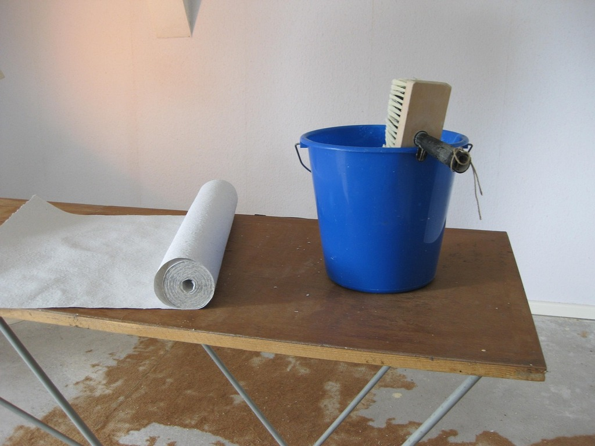

<!--

author:   DiAgnostiK-Coach
email:    info@gkz-ev.de
version:  0.1.0
language: de
narrator: Deutsch Male

edit: true
date: 2026-04-27

icon: ../assets/img/Logo_234px.png
logo: ../assets/img/tapete_eimer.jpg

attribute: Logo-Bild: Pixabay, Vilkasss

comment:  Lerneinheit – Untertapeten: Arten, Funktion und vollständiger Arbeitsablauf beim Verarbeiten von Makulatur und Glattvlies

title: Untertapeten verarbeiten – Makulatur, Glattvlies und der richtige Arbeitsablauf

tags:   Maler,
        Lackierer,
        Raumausstatter,
        Tapezieren,
        Untertapete,
        Makulatur,
        Glattvlies,
        Arbeitsablauf

link: ./style.css

import: https://raw.githubusercontent.com/Ifi-DiAgnostiK-Project/Piktogramme/refs/heads/main/makros.md
        https://raw.githubusercontent.com/Ifi-DiAgnostiK-Project/Bildersammlung/refs/heads/main/makros.md

-->

# Untertapeten verarbeiten 📋

Wer tapeziert, fängt nicht mit der Dekortapete an.
Zuerst kommt der Untergrund — und der wird mit einer Untertapete vorbereitet.
Wer diesen Schritt überspringt, erkauft sich Probleme: Blasen, schlechte Haftung, sichtbare Nähte.

<!-- class="highlight" -->
In dieser Lerneinheit lernen Sie: Was ist eine Untertapete? Welche Arten gibt es? Wie prüfen Sie den Untergrund? Und wie läuft die Verarbeitung Schritt für Schritt ab?

 

<!-- style="max-width: 550px; width: 100%" -->

## Was ist eine Untertapete?

    --{{0}}--
Eine Untertapete wird vor der eigentlichen Dekortapete aufgebracht. Sie dient nicht der Gestaltung — sondern der Vorbereitung des Untergrunds. Zwei Typen sind im Malerhandwerk gebräuchlich: Makulatur und Glattvlies.

### Die zwei Typen der Untertapete

| Typ | Material | Funktion | Wann einsetzen? |
|-----|----------|----------|-----------------|
| **Makulatur** (Untergrundtapete) | Dünnes, glattes Papier (oft recycelt) | Untergrund angleichen, Saugfähigkeit ausgleichen, kleine Unebenheiten kaschieren | Standard-Untergrund vor Dekortapete |
| **Glattvlies** | Vliesstoff (Kunstfaser) | Gleiche Funktion wie Makulatur, aber stabiler — weniger anfällig gegen Feuchtigkeit und Dehnung | Problematische Untergründe, feuchte Räume |

<!-- class="box" -->
**Merksatz:** Makulatur und Glattvlies haben dieselbe Aufgabe — sie bereiten den Untergrund für die Dekortapete vor. Glattvlies ist robuster, aber auch teurer.

    --{{1}}--
Warum überhaupt eine Untertapete? Ohne sie liegt die Dekortapete direkt auf einem möglicherweise unregelmäßigen, unterschiedlich saugenden Untergrund. Das Ergebnis: Blasen, unregelmäßige Kleisterverteilung, Nähte, die sich ablösen. Die Untertapete schafft eine gleichmäßige Basis — für ein sauberes Ergebnis.

      {{1}}
> **In der Praxis:** Makulatur ist die günstigere Wahl für normale, trockene Räume. Glattvlies empfiehlt sich in Küchen, Badezimmern oder bei stark rissigen Untergründen.

## Schritt 1: Untergrundprüfung

    --{{0}}--
Bevor die erste Untertapete klebt, muss der Untergrund geprüft werden. Die Prüfung folgt denselben Kriterien wie bei jeder anderen Beschichtung — und ist hier besonders wichtig, weil eine fehlgeschlagene Untertapete die gesamte nachfolgende Arbeit gefährdet.

**Kriterien der Untergrundprüfung vor dem Tapezieren:**

### Was muss der Untergrund erfüllen?

| Kriterium | Was bedeutet das? | Wie prüfen? |
|-----------|-------------------|------------|
| **Tragfähig** | Die Oberfläche hält den Zug der feuchten Tapete stand | Wischprobe, Klebebandtest |
| **Sauber** | Keine Fettrückstände, kein Staub, keine Trennmittel | Sichtprüfung, ggf. nachwaschen |
| **Trocken** | Keine aktive Feuchtigkeit | Hydrometer, Sichtprüfung |
| **Ausreichend saugfähig** | Kleister wird gleichmäßig aufgenommen | Benetzungsprobe mit Wasser |
| **Altanstriche entfernt oder gefestigt** | Kreidende oder ablösende Schichten wurden beseitigt | Wischprobe, Kratzprobe |

    --{{1}}--
Ein besonderer Punkt: Altanstriche. Wenn ein alter Anstrich kreidet — also bei Berührung Pigmente abgibt — klebt die Tapete nicht zuverlässig. Der kreidende Anstrich muss entweder entfernt oder mit einer Tiefengrundierung gefestigt werden. Dann erst kommt die Untertapete.

      {{1}}
> **In der Praxis:** Nach der Untergrundprüfung, wenn nötig: Altanstriche entfernen, nachwaschen, spachteln, schleifen, grundieren. Erst dann mit der Untertapete beginnen.

## Schritt 2–3: Aufmaß und Vorbereitung

    --{{0}}--
Vor dem ersten Kleistern müssen Sie wissen: Wie viel Material brauchen Sie? Und: Was gehört alles auf den Tapeziertisch?

### Aufmaß erstellen

**Wie berechnen Sie die benötigte Tapetenmenge?**

1. **Raumumfang messen:** Alle Wandflächen addieren — Breite × Höhe je Wand
2. **Fenster und Türen abziehen:** Fläche der Öffnungen abrechnen (Fenster: ca. 1,5–2 m², Tür: ca. 2 m²)
3. **Bahnlänge bestimmen:** Raumhöhe + Zugabe oben (ca. 5 cm) + Zugabe unten (ca. 5 cm)
4. **Anzahl Bahnen berechnen:** Umfang ÷ Bahnbreite (Standard: 53 cm oder 106 cm)
5. **Rollenanzahl ermitteln:** Anzahl Bahnen × Bahnlänge ÷ Rollenlänge

### Geräte und Werkzeuge bereitstellen

Alles was Sie brauchen — bevor Sie anfangen:

| Werkzeug / Material | Zweck |
|--------------------|-------|
| Gliedermaßstab | Messen und Abteilen der Tapetenbahnen |
| Cuttermesser | Bahnen auf Länge schneiden |
| Kleistergerät oder Kleisterbürste | Kleister auftragen |
| Kleister | Zum Einkleistern der Tapete oder der Wand |
| Tapezierbürste | Tapete andrücken |
| Naturschwamm | Kleisterreste sofort abwischen |
| Wasserwaage / Senklot | Erste Bahn ausrichten |

## Schritt 4–10: Der vollständige Arbeitsablauf

    --{{0}}--
Jetzt kommen die eigentlichen Verarbeitungsschritte. Die Reihenfolge ist bindend — jeder Schritt baut auf dem vorherigen auf. Wer Schritte vertauscht, bemerkt das Ergebnis spätestens an der Wand.

### Der vollständige Arbeitsablauf — 10 Schritte

| Schritt | Tätigkeit |
|---------|----------|
| **1** | Aufmaß der Flächen und Mengenberechnung |
| **2** | Geräte und Werkzeuge bereitstellen |
| **3** | Untergrund prüfen und vorbereiten |
| **4** | Altanstriche bzw. Alttapeten entfernen |
| **5** | Spachteln und schleifen |
| **6** | Kleister für Kleistergerät ansetzen |
| **7** | Kleistergerät mit Kleister und Tapete bestücken |
| **8** | Tapeten einkleistern |
| **9** | Tapeten verkleben: erst Decke, dann Wand |
| **10** | Anschlüsse an Wand, Decke und Scheuerleisten sauber abschneiden |

    --{{1}}--
Schauen wir uns Schritt 9 genau an: erst Decke, dann Wand. Das ist kein Zufall. Wenn Sie die Wand zuerst tapezieren und dann die Decke angreifen, tropft Kleister auf die fertige Wandtapete. Reihenfolge: immer von oben nach unten.

      {{1}}
> **Merkhilfe für die Reihenfolge:** „Planen → Ausrüsten → Prüfen → Bereinigen → Glätten → Kleistern → Tapezieren (Decke vor Wand) → Abschneiden." Zehn Schritte, keine Abkürzungen.

## Die richtigen Werkzeuge — und die falschen

    --{{0}}--
Im Übungsmodul wird abgefragt, welche Werkzeuge für das Anbringen einer Untertapete geeignet sind. Das klingt einfach — aber einige Werkzeuge werden verwechselt oder falsch zugeordnet.

### Richtige Werkzeuge für die Untertapete

| Werkzeug | Warum geeignet? |
|----------|----------------|
| **Tapezierbürste** | Tapete nach dem Anbringen andrücken und Luft herausstreichen |
| **Gliedermaßstab / Zollstock** | Abmessen der Bahnen |
| **Cuttermesser** | Sauberes Abschneiden an Anschlüssen |
| **Makulaturtapete / Untertapete** | Das Material selbst |

### Nicht geeignet für die Untertapete

| Werkzeug | Warum nicht geeignet? |
|----------|-----------------------|
| **Heißluftfön** | Zum Entfernen von Tapeten — nicht zum Verkleben |
| **Malerstock** | Hilfsgerät beim Streichen, nicht beim Tapezieren |
| **Naturschwamm** | Zum Abwischen von Kleisterresten — nicht zum Andrücken |

<!-- class="box" -->
**Merksatz:** Tapezierbürste zum Andrücken. Naturschwamm zum Abwischen. Heißluftfön zum Entfernen. Keines davon ist austauschbar.

## Zusammenfassung – Untertapeten

### Kernaussagen auf einen Blick

| Thema | Das Wichtigste |
|-------|---------------|
| Untertapetentypen | Makulatur (Papier) und Glattvlies — gleiche Funktion, unterschiedliche Robustheit |
| Untergrundprüfung | Tragfähig, sauber, trocken, gleichmäßig saugfähig — immer zuerst |
| Aufmaß | Umfang messen, Abzüge berechnen, Bahnlänge bestimmen, Rollenzahl ermitteln |
| Reihenfolge | 10 Schritte — Decke immer vor Wand tapezieren |
| Werkzeuge | Tapezierbürste (Andrücken), Gliedermaßstab (Messen), Cuttermesser (Schneiden) |

<!-- class="highlight" -->
**Nächster Schritt:** Testen Sie Ihr Wissen im Übungsmodul „Verarbeitung von Untertapeten".

 

<!-- style="max-width: 400px; width: 100%" -->

