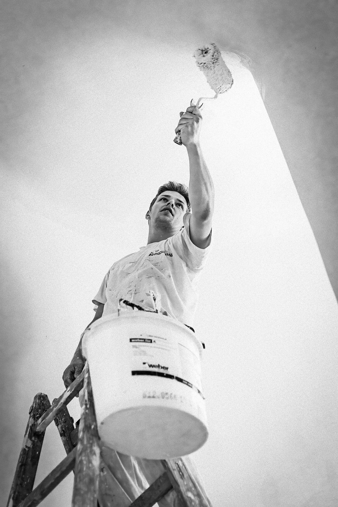

<!--

author:   DiAgnostiK-Coach
email:    info@gkz-ev.de
version:  0.1.0
language: de
narrator: Deutsch Male

edit: https://github.dev/Ifi-DiAgnostiK-Project/Malerhandwerk/blob/main/materials/maler_wdvs_ablauf.md
date: 2026-04-27

icon: ../assets/img/Logo_234px.png
logo: ../assets/img/maler_gray.jpg

attribute: Logo-Bild: Pixabay

comment:  Lerneinheit – WDVS Arbeitsablauf: Untergrundvorbereitung, Sockelanschluss, Dämmplatten, Armierung und Beschichtung

title: WDVS Arbeitsablauf – Von der Untergrundvorbereitung bis zur Schlussbeschichtung

tags:   Maler,
        Lackierer,
        WDVS,
        Wärmedämmung,
        Fassade,
        Arbeitsablauf,
        Sockelschiene,
        Armierung,
        MGI

link: ./style.css

import: https://raw.githubusercontent.com/Ifi-DiAgnostiK-Project/Piktogramme/refs/heads/main/makros.md
        https://raw.githubusercontent.com/Ifi-DiAgnostiK-Project/Bildersammlung/refs/heads/main/makros.md

-->

# WDVS Arbeitsablauf 🔧

Sie kennen den Schichtenaufbau eines WDVS. Jetzt kommt die entscheidende Frage: In welcher Reihenfolge wird das System aufgebaut?
Die Schrittfolge ist verbindlich — Fehler in der Reihenfolge können die Systemzulassung gefährden und zu Schäden führen.

<!-- class="highlight" -->
In dieser Lerneinheit lernen Sie: Wie wird die Fassade vorbereitet? Wie wird die Sockelschiene gesetzt? Wie werden Dämmplatten befestigt? Wie wird die Armierungsschicht korrekt ausgeführt? Und wie wird die Beschichtung aufgebracht?

 

<!-- style="max-width: 550px; width: 100%" -->

## Überblick: 3 Phasen, 9 Schritte

    --{{0}}--
Der WDVS-Arbeitsablauf gliedert sich in drei Phasen: Zuerst die Reinigung und Vorbereitung des Untergrunds, dann das Aufbringen des Dämmverbundsystems, und schließlich die Beschichtung. Jede Phase hat drei Kernschritte.

### Der WDVS-Arbeitsablauf — 3 Phasen

| Phase | Inhalt |
|-------|--------|
| **Phase 1: Reinigung** | Untergrundprüfung, Reinigung, Verfestigung |
| **Phase 2: Aufbringen** | Sockelschienen, Dämmplatten, Armierungsschicht |
| **Phase 3: Beschichtung** | Grundierung, Strukturputz, Fassadenanstrich |

    --{{1}}--
Merken Sie sich diese drei Phasen als Grundstruktur. In der Prüfung wird oft nicht der vollständige Ablauf, sondern eine einzelne Phase oder ein Einzelschritt abgefragt. Wenn Sie die drei Phasen als Gerüst kennen, finden Sie sich schnell zurecht.

      {{1}}
> **Merkhilfe:** „Reinigen — Aufbringen — Beschichten." Drei Phasen, neun Schritte. Die Reihenfolge ist nicht verhandelbar.

## Phase 1: Untergrundvorbereitung

    --{{0}}--
Bevor die erste Dämmplatte klebt, muss die Fassade vorbereitet sein. Eine ungeeignete Fassade ist kein geeigneter Untergrund — und damit kein geeignetes Substrat für ein WDVS.

### Phase 1: Reinigung — 3 Schritte

| Schritt | Tätigkeit | Anmerkung |
|---------|----------|-----------|
| **1** | Untergrundprüfung durchführen — Fassade reinigen | Tragfähigkeit, Sauberkeit, Trockenheit prüfen |
| **2** | Lockeren Putz entfernen und nachputzen | Hohlstellen und Schäden vorher ausflicken |
| **3** | Putzgrundierung aufbringen | Saugfähigkeit angleichen — Haftung des Klebers sicherstellen |

**Anforderungen an den Untergrund — Checkliste:**

### Was muss die Fassade erfüllen?

| Kriterium | Anforderung |
|-----------|-------------|
| Tragfähigkeit | Untergrund hält die Scherkräfte des WDVS stand |
| Sauberkeit | Kein Schmutz, keine Fettrückstände, kein Staub |
| Trennmittelfreiheit | Keine wasserabweisenden Beschichtungen |
| Keine kreidenden Anstriche | Kreidende Oberflächen müssen entfernt oder verfestigt werden — **sie sind nicht zulässig** |
| Ausreichend eben | Unebenheiten >10 mm: vorher ausgleichen |

<!-- class="box" -->
**Merksatz:** Kreidende Anstriche an der Fassade sind ein Ausschlusskriterium. WDVS und kreidender Untergrund sind nicht kombinierbar.

## Phase 2a: Sockelschiene setzen

    --{{0}}--
Die Sockelschiene — auch Startprofil oder Abstandsprofil genannt — ist die Basis für die erste Reihe der Dämmplatten. Sie wird horizontal an der Fassade befestigt und muss exakt ausgerichtet sein. Fehler hier übertragen sich auf alle folgenden Plattenreihen.

**Anforderungen an die Sockelschiene:**

### Sockelschiene — Anforderungen und Funktion

| Aspekt | Anforderung / Funktion |
|--------|----------------------|
| **Ausrichtung** | Lotrecht und waagerecht — mit Wasserwaage und Schnurausrichtung prüfen |
| **Funktion** | Startprofil für die erste Dämmplattenreihe — definiert Niveau und Abstand zur Wand |
| **Anschluss** | Gleitender Anschluss zum Bestandsgebäude — keine starre Verbindung (Bewegungsausgleich) |
| **Befestigung** | Dübelabstand gemäß Herstellervorgabe — nicht freihändig schrauben |

    --{{1}}--
Der Begriff „gleitender Anschluss" taucht in Prüfungsaufgaben auf. Er bedeutet: Die Sockelschiene darf nicht starr mit dem Bestandsgebäude verbunden werden. Temperatur und Feuchtigkeit bewegen das Gebäude minimal — eine starre Verbindung würde zu Rissen führen. Der gleitende Anschluss erlaubt diese Bewegungen.

      {{1}}
> **In der Praxis:** Sockelschiene immer zuerst mit Wasserwaage ausrichten — dann Dübel setzen. Nie umgekehrt. Eine einzige schiefe Schiene zieht alle folgenden Plattenreihen schief.

## Phase 2b: Dämmplatten befestigen

    --{{0}}--
Die Dämmplatten werden mit Kleber befestigt — und zusätzlich mit Dübeln mechanisch gesichert. Das Kombinieren von Kleben und Dübeln ist bei WDVS Standard. Kleber allein reicht für Windsogsicherung nicht aus.

### Dämmplatten — Befestigungsregeln

| Schritt | Anforderung |
|---------|------------|
| **Kleber auftragen** | Umlaufend als Wulst + 3 Kleberflecken in der Plattenmitte — Klebeanteil ≥ 40 % |
| **Platten setzen** | Versatzverband — keine durchgehenden senkrechten Fugen |
| **Andrücken** | Kräftig andrücken — vollflächiger Kontakt mit Untergrund |
| **Dübeln** | Nach Abbinden des Klebers: Telleranker setzen (Anzahl und Position nach Systemzulassung) |
| **Fugen schließen** | Keine offenen Fugen — Dämmmaterial einfüllen oder abschneiden |

<!-- class="box" -->
**Merksatz:** Versatzverband — keine Kreuzfugen. Wie beim Mauerwerk gilt: Fugen der unteren Reihe dürfen nie mit denen der oberen Reihe fluchten.

## Phase 2c: Armierungsschicht ausführen

    --{{0}}--
Nach dem Aufbringen der Dämmplatten kommt die Armierungsschicht — die mechanische Verstärkungsschicht aus Armierungsmasse und Glasfasergewebe. Sie schützt den Dämmstoff vor mechanischen Einwirkungen und verhindert Risse in der Putzoberfläche.

### Armierungsschicht — Ausführungsregeln

| Aspekt | Regel |
|--------|-------|
| **Eckschutzprofile** | An allen Außenecken Eckschutzschienen einbauen — vor dem Armierungsgewebe |
| **Armierungsmasse** | Gleichmäßig mit Zahnspachtel auf die Dämmplatten auftragen |
| **Gewebe einbetten** | Glasfasergewebe mittig in die noch frische Armierungsmasse eindrücken |
| **Überlappung** | Mindestens **10 cm** an allen Stößen |
| **Einbettung** | Gewebe muss vollständig in der Mörtelschicht versinken — **nicht an der Oberfläche sichtbar** |

    --{{1}}--
Zwei Punkte werden in Prüfungen häufig abgefragt: Überlappung mindestens 10 cm — und das Gewebe wird mittig eingebettet, nicht an der Oberfläche. An der Oberfläche sichtbares Gewebe = Verarbeitungsfehler. Das Gewebe muss von Mörtel umhüllt sein.

      {{1}}
> **Merkhilfe:** „Mörtel drauf, Gewebe rein, Mörtel drüber." Das Gewebe liegt in der Mitte — nicht auf dem Dämmer, nicht an der Luft.

## Phase 3: Beschichtung

    --{{0}}--
Nach dem Aushärten der Armierungsschicht folgt die Beschichtung. Sie besteht aus drei Schritten: Grundierung, Strukturputz und Fassadenanstrich.

### Phase 3: Beschichtung — 3 Schritte

| Schritt | Tätigkeit | Material (Beispiel) |
|---------|----------|---------------------|
| **7** | Grundierung aufbringen | Sto-Putzgrund |
| **8** | Strukturputz aufbringen | Strukturputz K 2,0 |
| **9** | Fassadenanstrich aufbringen | Fassadenfarbe nach Wahl |

**Warum Grundierung vor dem Strukturputz?**

### Funktion der Grundierung

| Funktion | Erklärung |
|----------|-----------|
| Haftvermittlung | Strukturputz hält besser auf der Armierungsschicht |
| Ausgleich der Saugfähigkeit | Verhindert unregelmäßige Aufnahme des Putzes |
| Farbanpassung | Grundierfarbe wird passend zum Endbeschichtungsfarbon gewählt — verhindert Durchscheinen |

<!-- class="box" -->
**Merksatz:** Grundierung immer vor Strukturputz. Nie überspringen. Der Mehraufwand ist gering — die Wirkung auf das Endergebnis erheblich.

## Der vollständige Ablauf — Überblick

### WDVS Arbeitsablauf — 9 Schritte

| # | Phase | Schritt |
|---|-------|--------|
| 1 | Reinigung | Untergrundprüfung + Fassade reinigen |
| 2 | Reinigung | Lockeren Putz entfernen + nachputzen |
| 3 | Reinigung | Putzgrundierung aufbringen |
| 4 | Aufbringen | Sockelschienen setzen (lot- und waagerecht, gleitender Anschluss) |
| 5 | Aufbringen | WDVS-Platten verkleben und dübeln (Versatzverband) |
| 6 | Aufbringen | Eckschutzschienen + Armierungsmasse + Gewebe (≥10 cm Überlappung, mittig eingebettet) |
| 7 | Beschichtung | Grundierung aufbringen |
| 8 | Beschichtung | Strukturputz aufbringen |
| 9 | Beschichtung | Fassadenanstrich aufbringen |

<!-- class="highlight" -->
**Nächster Schritt:** Im Übungsmodul „MGI 1-04 – WDVS" werden Schichtenaufbau, Sockelschienendetails und Armierungsregeln als Drag-and-Drop und Quiz abgefragt.

 

<!-- style="max-width: 400px; width: 100%" -->

