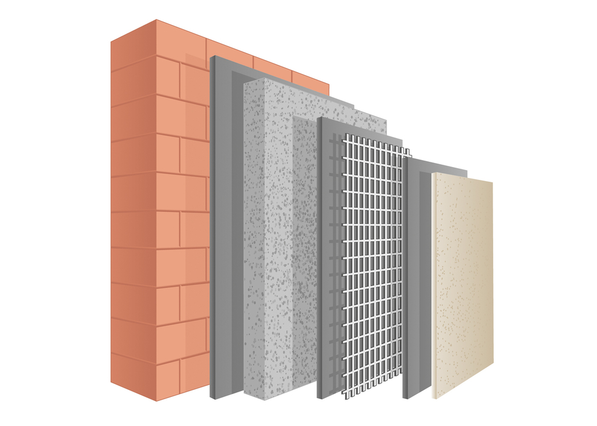

<!--

author:   DiAgnostiK-Coach
email:    info@gkz-ev.de
version:  0.1.0
language: de
narrator: Deutsch Male

edit: true
date: 2026-04-27

icon: ../assets/img/Logo_234px.png
logo: ../assets/img/bauwerk_schichten.jpg

attribute: Logo-Bild: Pixabay

comment:  Lerneinheit – WDVS Aufbau: Die 7 Schichten eines Wärmedämm-Verbundsystems, ihre Materialien und Funktionen

title: WDVS Aufbau – Die 7 Schichten des Wärmedämm-Verbundsystems

tags:   Maler,
        Lackierer,
        WDVS,
        Wärmedämmung,
        Fassade,
        Schichtenaufbau,
        MGI

link: ./style.css

import: https://raw.githubusercontent.com/Ifi-DiAgnostiK-Project/Piktogramme/refs/heads/main/makros.md
        https://raw.githubusercontent.com/Ifi-DiAgnostiK-Project/Bildersammlung/refs/heads/main/makros.md

-->

# WDVS – Aufbau und Schichten 🏗️

Ein Wärmedämm-Verbundsystem ist keine einfache Farbbeschichtung.
Es ist ein technisches System aus mehreren Schichten — und jede Schicht hat eine klar definierte Funktion.
Wer den Aufbau nicht kennt, kann weder richtig verarbeiten noch Fehler erkennen.

<!-- class="highlight" -->
In dieser Lerneinheit lernen Sie: Aus welchen 7 Schichten besteht ein WDVS? Was ist die Funktion jeder Schicht? Welche Materialbezeichnungen sind relevant?

 

<!-- style="max-width: 550px; width: 100%" -->

## Was ist ein WDVS?

    --{{0}}--
WDVS steht für Wärmedämm-Verbundsystem. Es ist ein Fassadensystem, das direkt auf den Außenwänden eines Gebäudes angebracht wird, um Wärmeverluste zu reduzieren. Seit der Einführung der Energieeinsparverordnung ist WDVS ein Standardverfahren bei Neubau und Sanierung von Gebäuden.

### WDVS auf einen Blick

| Aspekt | Erklärung |
|--------|-----------|
| **Zweck** | Reduzierung von Wärmeverlusten durch die Außenwände — Energieeinsparung |
| **Einsatzbereich** | Neubau und energetische Sanierung von Gebäuden |
| **Aufbau** | Mehrere Schichten, die funktional aufeinander abgestimmt sind |
| **Normierung** | Zugelassene WDVS sind als System geprüft — Einzelkomponenten dürfen nicht beliebig getauscht werden |

<!-- class="box" -->
**Merksatz:** Ein WDVS ist kein improvisierbares System. Die Schichten müssen in der richtigen Reihenfolge mit aufeinander abgestimmten Produkten aufgebracht werden — gemäß Systemzulassung.

    --{{1}}--
Das ist ein wichtiger Punkt für die Praxis: Bei einem zugelassenen WDVS dürfen Sie nicht einfach den Kleber durch ein anderes Produkt ersetzen. Das System ist als Ganzes zugelassen. Einzelne Komponenten zu tauschen gefährdet die Zulassung und die Gewährleistung.

      {{1}}
> **In der Praxis:** Verwenden Sie immer Produkte desselben Systemherstellers — so wie im Leistungsverzeichnis angegeben. Beispiel: StoLevell Duo plus als Klebe- und Armierungsmasse ist Teil des Sto-Systems.

## Der Schichtenaufbau — 7 Schichten

    --{{0}}--
Von der Außenwand nach außen hin gibt es genau sieben Schichten. Jede hat eine Funktion. Kennen Sie alle sieben, kennen Sie das System.

### Die 7 Schichten eines WDVS — von innen nach außen

| # | Schicht | Beispielmaterial | Funktion |
|---|---------|-----------------|----------|
| **1** | Wand (Untergrund) | Mauerwerk, Beton | Tragende Struktur — Ausgangssubstrat |
| **2** | Kleber (Klebemörtel) | StoLevell Duo plus | Dämmplatten am Untergrund befestigen |
| **3** | Dämmstoff | EPS (Polystyrol) oder Mineralwolle | Wärmeschutz — verhindert Wärmeverlust durch die Wand |
| **4** | Armierungsmasse | StoLevell Duo plus | Verbindung zwischen Dämmstoff und Armierungsgewebe |
| **5** | Armierungsgewebe | Glasfasergewebe | Mechanische Verstärkung — verhindert Rissbildung |
| **6** | Grundierung | Sto-Putzgrund | Haftvermittler — sorgt für gleichmäßige Aufnahme des Oberputzes |
| **7** | Oberputz / Endbeschichtung | Strukturputz K 2,0 | Witterungsschutz und Gestaltung der Oberfläche |

<!-- class="box" -->
**Merksatz:** 7 Schichten — „Wand, Kleber, Dämmstoff, Armierungsmasse, Gewebe, Grundierung, Oberputz." Lernen Sie die Reihenfolge auswendig.

    --{{1}}--
Beachten Sie: Schicht 2 und Schicht 4 verwenden dasselbe Produkt — StoLevell Duo plus. Das ist kein Fehler. Dieses Produkt ist sowohl als Klebe- als auch als Armierungsmasse zugelassen. Viele Prüfungsaufgaben testen, ob Sie wissen, dass derselbe Mörtel zwei Funktionen hat.

      {{1}}
> **Merkhilfe:** „Kleber = Armierungsmasse" — im Sto-System ist es dasselbe Produkt (StoLevell Duo plus), das in zwei verschiedenen Schritten eingesetzt wird.

## Schicht 1: Wand (Untergrund)

    --{{0}}--
Die Wand ist der Ausgangspunkt. Sie muss bestimmte Anforderungen erfüllen, bevor das WDVS angebracht werden kann. Die Anforderungen an den Untergrund sind bindend — ein ungeeigneter Untergrund macht das gesamte System hinfällig.

**Anforderungen an die Wand:**

### Was muss der Untergrund erfüllen?

| Kriterium | Bedeutung |
|-----------|-----------|
| Tragfähig | Die Wand hält die Scherkräfte der befestigten Dämmplatten stand |
| Sauber | Keine Fettrückstände, kein Staub, keine Trennmittel |
| Frei von kreidenden Anstrichen | Kreidende Oberflächen lösen sich und reißen die Klebekraft mit |
| Ausreichend eben | Große Unebenheiten müssen vor dem Kleben ausgeputzt werden |

<!-- class="box" -->
**Merksatz:** Kreidende Anstriche sind ein K.-o.-Kriterium. Sie müssen vor dem WDVS vollständig entfernt oder verfestigt werden.

## Schicht 2 und 4: Klebe- und Armierungsmasse

    --{{0}}--
Das Produkt „StoLevell Duo plus" wird in zwei Arbeitsgängen eingesetzt: erst als Kleber für die Dämmplatten, dann als Einbettmörtel für das Armierungsgewebe. In beiden Fällen ist es dasselbe Material — nur der Zeitpunkt und die Funktion unterscheiden sich.

### StoLevell Duo plus — zwei Einsätze

| Einsatz | Schicht | Funktion |
|---------|---------|----------|
| **Kleben** | Schicht 2 | Dämmplatten kraftschlüssig mit dem Untergrund verbinden |
| **Armieren** | Schicht 4 | Armierungsgewebe in die Mörtelschicht einbetten |

**Auftragsmethode beim Kleben:**

- Umlaufend als Randwulst auf die Dämmplatte auftragen
- Drei Kleberflecken in der Plattenmitte setzen
- Platte kraftschlüssig andrücken, Klebeanteil ≥ 40 % der Plattenoberfläche

## Schicht 3: Dämmstoff

    --{{0}}--
Der Dämmstoff ist das Herzstück des Systems. Zwei Materialien sind gebräuchlich — expandiertes Polystyrol (EPS) und Mineralwolle. Beide dämmen, aber sie unterscheiden sich in den Eigenschaften.

### Dämmstoffarten im Vergleich

| Eigenschaft | EPS (Polystyrol) | Mineralwolle |
|-------------|-----------------|-------------|
| **Wärmedämmung** | Gut | Sehr gut |
| **Brandverhalten** | Schwer entflammbar (B2) | Nicht brennbar (A1) — Baustoffklasse A |
| **Gewicht** | Leicht | Schwerer |
| **Feuchtebeständigkeit** | Gut | Kann bei dauerhafter Feuchtigkeit nachlassen |
| **Einsatz** | Standard WDVS | Brandschutzanforderungen, Sockelbereiche |

<!-- class="box" -->
**Merksatz:** Mineralwolle ist nicht brennbar — wichtig in Bereichen mit erhöhten Brandschutzanforderungen (z. B. über Fenstern, in bestimmten Gebäudeklassen).

## Schicht 5: Armierungsgewebe

    --{{0}}--
Das Armierungsgewebe aus Glasfaser wird in die noch frische Armierungsmasse eingebettet. Es verhindert Rissbildung in der Putzoberfläche — besonders an Belastungspunkten wie Ecken, Fensterlaibungen und Anschlussprofilen.

**Wichtige Regeln beim Armierungsgewebe:**

### Verarbeitungsregeln Armierungsgewebe

| Regel | Warum? |
|-------|--------|
| Überlappung mindestens **10 cm** | Keine Unterbrechung der Armierungsschicht — Rissfreiheit sicherstellen |
| Gewebe **mittig** in die Armierungsmasse einbetten | Nicht an der Oberfläche, nicht am Untergrund — in der Mitte für optimalen Verbund |
| An Ecken und Laibungen **diagonal** anlegen | Diagonal-Armierung an Spannungskonzentrationspunkten verhindert Risse |

## Schichten 6 und 7: Grundierung und Oberputz

    --{{0}}--
Die Grundierung bereitet die Armierungsschicht für den Oberputz vor. Der Oberputz ist die sichtbare Außenschicht — er muss witterungsbeständig sein und gibt der Fassade ihr Erscheinungsbild.

### Grundierung und Oberputz

| Schicht | Produkt | Funktion |
|---------|---------|----------|
| **Grundierung** | Sto-Putzgrund | Haftvermittler, gleicht Saugfähigkeit aus, verhindert Ausblühen |
| **Oberputz** | Strukturputz K 2,0 | Witterungsschutz, Gestaltung (Körnung 2,0 mm = Kratzputz-Optik) |

**Strukturputz K 2,0 — was bedeutet die Bezeichnung?**
- **K** = Kratzputz (mit Reibebrett kreisförmig bearbeitet)
- **2,0** = Korngröße 2,0 mm

## Zusammenfassung – WDVS Schichtenaufbau

### Die 7 Schichten — Kurzübersicht

| # | Schicht | Material |
|---|---------|----------|
| 1 | Wand | Mauerwerk / Beton |
| 2 | Kleber | StoLevell Duo plus |
| 3 | Dämmstoff | EPS oder Mineralwolle |
| 4 | Armierungsmasse | StoLevell Duo plus |
| 5 | Armierungsgewebe | Glasfasergewebe |
| 6 | Grundierung | Sto-Putzgrund |
| 7 | Oberputz | Strukturputz K 2,0 |

<!-- class="highlight" -->
**Nächster Schritt:** Testen Sie Ihr Wissen im Übungsmodul „MGI 1-04 – WDVS".

 

<!-- style="max-width: 400px; width: 100%" -->

