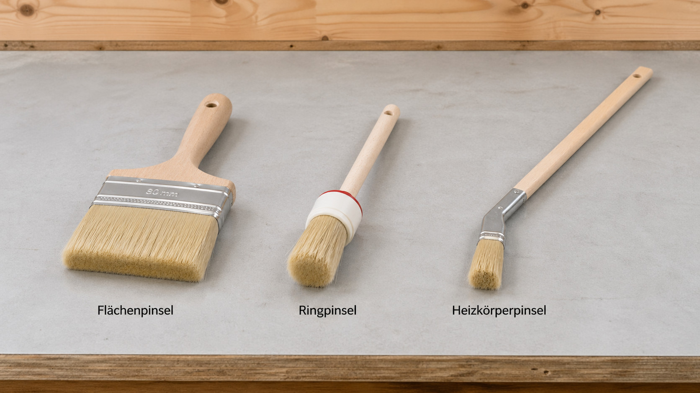
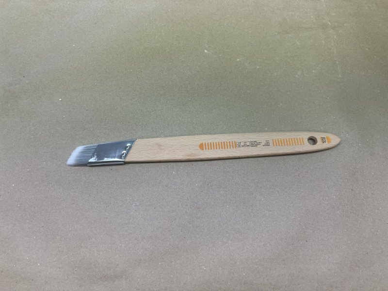
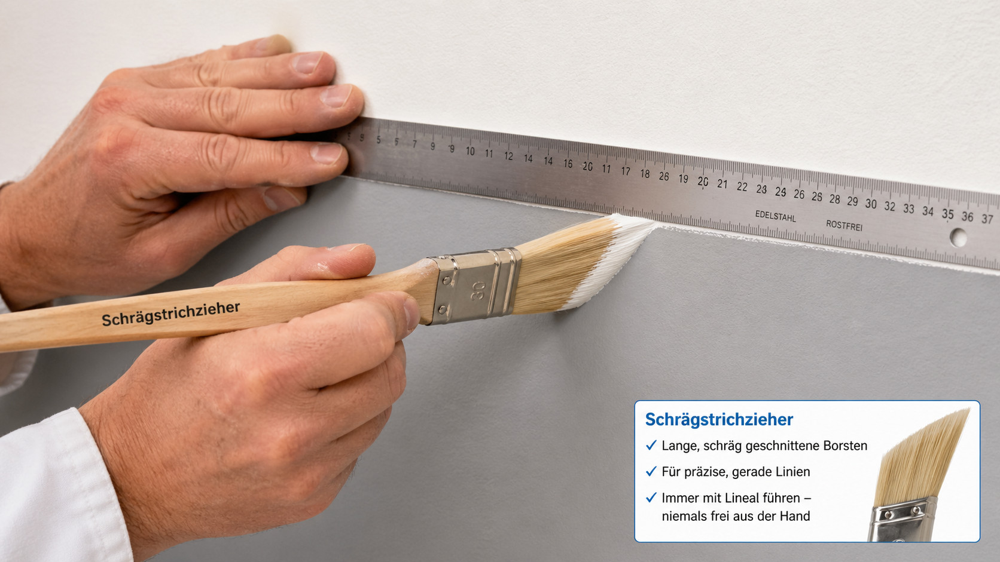
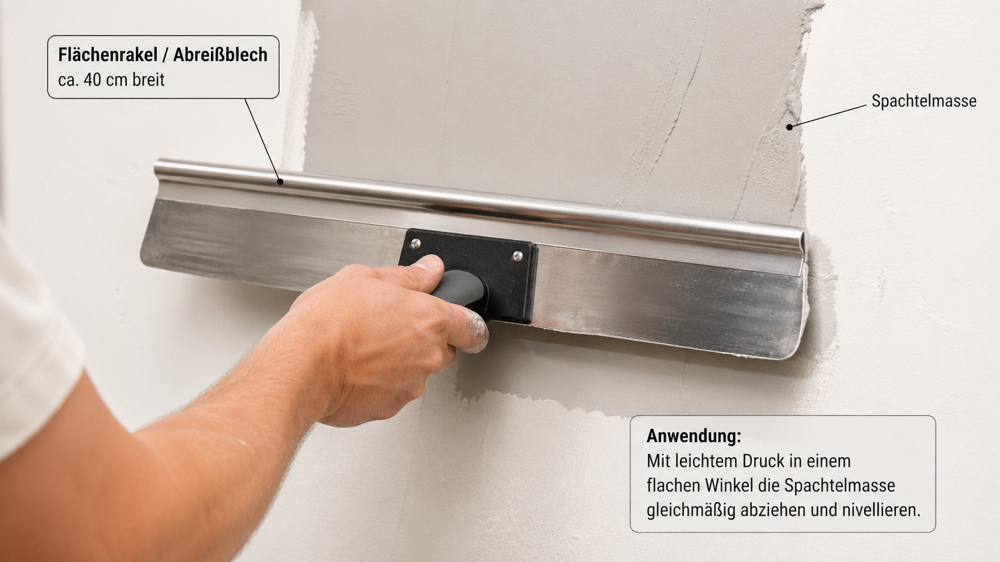
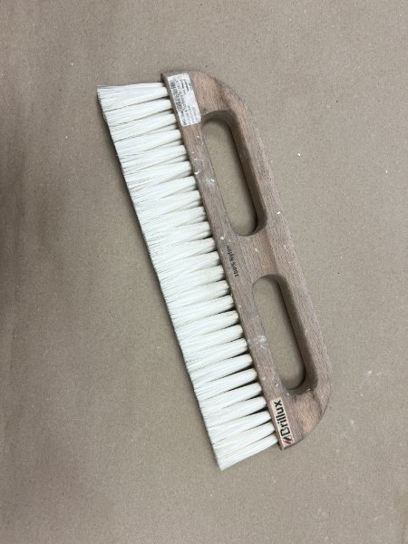

<!--

author:   DiAgnostiK-Coach
email:    info@gkz-ev.de
version:  0.1.0
language: de
narrator: Deutsch Male

edit: https://github.dev/Ifi-DiAgnostiK-Project/Malerhandwerk/blob/main/materials/maler_werkzeuge_grundlagen.md
date: 2026-04-27

icon: ../assets/img/Logo_234px.png
logo: ../assets/img/malerrollen_fensterbrett.jpg

attribute: Logo-Bild: Pixabay, stux

comment:  Lerneinheit – Werkzeuge im Maler- und Lackiererhandwerk: Pinsel, Rollen, Spachtel, Rakel, Bürsten und Strichzieher

title: Werkzeuge im Maler- und Lackiererhandwerk – Grundlagen

tags:   Maler,
        Lackierer,
        Handwerk,
        Werkzeuge,
        Pinsel,
        Rolle,
        Spachtel,
        Grundlagen

link: ./style.css

import: https://raw.githubusercontent.com/Ifi-DiAgnostiK-Project/Piktogramme/refs/heads/main/makros.md
        https://raw.githubusercontent.com/Ifi-DiAgnostiK-Project/Bildersammlung/refs/heads/main/makros.md

-->

# Werkzeuge im Maler- und Lackiererhandwerk 🧑‍🎨

Bevor Sie anfangen zu streichen, zu spachteln oder zu tapezieren — schauen Sie sich Ihr Werkzeug an.
Wer ein Werkzeug falsch benennt, greift im Betrieb zum falschen Gerät.
Wer es richtig kennt, arbeitet schneller und sauberer.

<!-- class="highlight" -->
In dieser Lerneinheit lernen Sie die wichtigsten Werkzeuge des Malerhandwerks kennen: was sie heißen, wofür sie eingesetzt werden und wie sie sich voneinander unterscheiden.

 

")

## Flächenpinsel, Ringpinsel, Heizkörperpinsel

    --{{0}}--
Fangen wir mit den drei Standardpinseln an. Jeder hat seinen festen Platz. Der Unterschied liegt in der Form — und die Form bestimmt den Einsatz. Schauen Sie sich jeden einzeln an.

Drei Pinsel, drei Einsatzbereiche.

    --{{1}}--
Der Flächenpinsel ist der Arbeitspinsel für große, glatte Flächen: Wände, Decken, Türen. Er ist breit und flach. An Kanten oder Ecken ist er zu ungenau — dafür gibt es den Ringpinsel.

      {{1}}
> **Flächenpinsel** — breit, flach, für große Flächen.
> Einsatz: Wände, Decken, Türblätter, Fensterrahmen.
> Erkennungsmerkmal: breite Klingenform, gleichmäßige Borstenlänge.

    --{{2}}--
Der Ringpinsel — auch Rundpinsel genannt — ist rund und wendig. Er kommt überall hin, wo der Flächenpinsel zu breit ist: Kanten, Ecken, Leisten, Rohre. Der runde Borstenkopf ist sein Erkennungsmerkmal.

      {{2}}
> **Ringpinsel / Rundpinsel** — rund, wendig, für Details.
> Einsatz: Kanten, Ecken, Leisten, Rohre.
> Erkennungsmerkmal: kreisrunder Borstenkopf.

    --{{3}}--
Der Heizkörperpinsel ist ein Spezialpinsel. Sein Erkennungsmerkmal: der gebogene oder verlängerte Stiel. Damit kommt er hinter Heizkörper, in Nischen — ohne Verrenkungen.

      {{3}}
> **Heizkörperpinsel** — für schwer erreichbare Stellen.
> Einsatz: hinter Heizkörpern, Rohrverkleidungen, Nischen.
> Erkennungsmerkmal: auffällig langer oder gewinkelter Stiel.

    --{{4}}--
Alle drei auf einen Blick.

      {{4}}

### Drei Pinsel im Vergleich

| Pinsel | Erkennungsmerkmal | Einsatz |
|--------|-------------------|---------|
| Flächenpinsel | breit, flach | Wände, Decken, Türen |
| Ringpinsel / Rundpinsel | runder Borstenkopf | Kanten, Ecken, Leisten |
| Heizkörperpinsel | langer / gebogener Stiel | hinter Heizkörpern, Nischen |

    --{{5}}--
Kurze Selbstkontrolle.

      {{5}}

**Welchen Pinsel nehmen Sie für Kanten und Ecken?**

- [( )] Flächenpinsel
- [(X)] Ringpinsel / Rundpinsel
- [( )] Heizkörperpinsel

## Strichzieher – gerade Linien ziehen

    --{{0}}--
Der Strichzieher ist kein normaler Pinsel — auch wenn er auf den ersten Blick so aussieht. Er ist ein Präzisionswerkzeug für gerade Linien. Sein Name sagt es: Striche ziehen. Schauen Sie sich das Bild an — das ist ein Schrägstrichzieher.

    --{{1}}--
Was den Strichzieher vom Flächenpinsel unterscheidet: die Borsten. Sie sind deutlich länger und weicher. Beim Schrägstrichzieher zusätzlich schräg abgeschnitten. Und: Er wird immer mit einem Lineal geführt. Ohne Lineal keine gerade Linie.

      {{1}}
> **Merkmale des Strichziehers:**
> - Borsten deutlich länger als beim normalen Pinsel
> - Beim Schrägstrichzieher: Borsten schräg abgeschnitten
> - Wird **immer mit Lineal** geführt — niemals frei aus der Hand

    --{{2}}--
Der Strichzieher wird für drei Aufgaben eingesetzt: Farbflächen an der Kante beschneiden, Kontrastlinien zwischen zwei Farben ziehen, und dekorative Linien setzen. Immer mit Lineal.

      {{2}}
> **Einsatzbereiche:**
> - Kontrastlinien und Abgrenzungen zwischen Farbflächen
> - Farbflächen an der Kante beschneiden (Gestaltungsarbeiten)
> - Sockellinien, dekorative Rahmen, Wandgliederungen

    --{{3}}--
So sieht der Strichzieher im Einsatz aus — mit Lineal an der Wand. Achten Sie auf die langen Borsten und die Führung am Lineal.

      {{3}}

    --{{4}}--
Verwechslungsgefahr: Auf einem Foto kann der Strichzieher wie ein großer Flächenpinsel aussehen. Das Unterscheidungsmerkmal: Die Borsten sind auffällig lang — oft doppelt so lang wie beim Flächenpinsel gleicher Breite.

      {{4}}

### Strichzieher ≠ Flächenpinsel

| Merkmal | Flächenpinsel | Strichzieher |
|---------|--------------|-------------|
| Borstenlänge | kurz bis mittel | auffällig lang |
| Borstenschnitt | gerade | schräg (Schrägstrichzieher) |
| Führung | frei aus der Hand | immer mit Lineal |
| Einsatz | Flächen streichen | Linien ziehen |

    --{{5}}--
Selbstkontrolle.

      {{5}}

**Wofür wird der Strichzieher eingesetzt?**

- [(X)] Kontrastlinien und Farbflächenabgrenzungen — immer mit Lineal
- [( )] Große Flächen streichen
- [( )] Kleister auftragen beim Tapezieren

## Rollen – der Flor entscheidet

    --{{0}}--
Die Rolle ist das schnellste Werkzeug für große Flächen. Aber: Nicht jede Rolle passt zu jedem Untergrund. Der entscheidende Unterschied ist der Flor — also die Länge der Fasern auf der Rolle. Langes Haar kommt tiefer in die Vertiefungen.

<!-- style="max-width: 400px; width: 100%" -->

    --{{1}}--
Kurzflor — 4 bis 6 Millimeter. Für glatte Untergründe: Gipskarton, Glattputz, Lacke. Die kurzen Fasern geben die Farbe gleichmäßig ab. Auf Raufaser eingesetzt: Die Vertiefungen bleiben leer — das Ergebnis sieht nach dem Trocknen fleckig aus.

      {{1}}
> **Kurzflor (4–6 mm)**
> Geeignet für: Gipskarton, Glattputz, Lack, Dispersionsfarbe auf glattem Untergrund.
> Nicht geeignet für: Raufaser, strukturierte Oberflächen.

    --{{2}}--
Mittelflor — 10 bis 12 Millimeter. Der Allrounder. Für leicht strukturierte Flächen wie Rauputz oder normale Raufaser. Die Fasern sind lang genug für Vertiefungen, kurz genug für ein gleichmäßiges Ergebnis.

      {{2}}
> **Mittelflor (10–12 mm)**
> Geeignet für: Rauputz, leicht strukturierte Oberflächen, normale Raufaser.
> Universell einsetzbar für die meisten Innenarbeiten.

    --{{3}}--
Langflor — 18 bis 25 Millimeter. Für stark strukturierte Flächen: grobe Raufaser, unebene Außenwände. Die langen Fasern dringen tief in die Struktur ein. Auf glatten Flächen: zu viel Textur im Ergebnis.

      {{3}}
> **Langflor (18–25 mm)**
> Geeignet für: grobe Raufaser, stark strukturierte Außenwände.
> Nicht geeignet für: glatte Flächen — hinterlässt zu viel Textur.

    --{{4}}--
Merksatz: Je rauer der Untergrund, desto länger der Flor.

      {{4}}

### Florlänge auf einen Blick

| Florlänge | Geeignet für |
|-----------|-------------|
| **Kurzflor** (4–6 mm) | Glatt: Gipskarton, Glattputz, Lack |
| **Mittelflor** (10–12 mm) | Leicht strukturiert: Rauputz, normale Raufaser |
| **Langflor** (18–25 mm) | Stark strukturiert: grobe Raufaser, Außenwand |

<!-- class="box" -->
**Merksatz:** Je rauer der Untergrund — desto länger der Flor.

    --{{5}}--
Selbstkontrolle: Sie streichen eine Wand mit grober Raufaser. Welche Rolle?

      {{5}}

**Welche Rolle für eine Wand mit grober Raufaser?**

- [( )] Kurzflor (4–6 mm)
- [( )] Mittelflor (10–12 mm)
- [(X)] Langflor (18–25 mm)

## Spachtel – Ausbesserungen und Feinarbeiten

    --{{0}}--
Spachtel werden eingesetzt, um Schadstellen auszubessern und Oberflächen zu glätten. Zwei Typen müssen Sie kennen: den Malerspachtel für größere Schäden und den Japanspachtel für Feinarbeiten.

<!-- style="max-width: 400px; width: 100%" -->

    --{{1}}--
Der Malerspachtel — breit, robust. Einsatz: Schadstellen auffüllen, Altfarbe und Tapetenreste abschaben, lose Beschichtungen entfernen. Zu ungenau für filigrane Ausbesserungen.

      {{1}}
> **Malerspachtel** (auch: Putzmesser)
> Einsatz: Schadstellen auffüllen, Altfarbe und Tapetenreste entfernen, lose Beschichtungen abschaben.
> Erkennungsmerkmal: breite, starre Metallklinge.

    --{{2}}--
Der Japanspachtel — schmal, flexibel. Das Präzisionswerkzeug: für kleine Löcher, Haarrisse, dünne Spachtellagen. Die flexible Klinge ermöglicht gleichmäßige, dünne Aufträge. Für grobe Arbeiten zu empfindlich.

      {{2}}
> **Japanspachtel** (auch: Feinspachtel)
> Einsatz: kleine Löcher, Haarrisse, dünne gleichmäßige Spachtellagen.
> Erkennungsmerkmal: schmalere, flexible Klinge.

    --{{3}}--
Die Abgrenzung: Japanspachtel für grobe Arbeiten → verbogene Klinge. Malerspachtel für Feinarbeiten → keine glatte Oberfläche.

      {{3}}

### Spachtel im Vergleich

| Werkzeug | Klinge | Einsatz |
|----------|--------|---------|
| **Malerspachtel** | breit, starr | Größere Schäden, Altbeschichtungen entfernen |
| **Japanspachtel** | schmal, flexibel | Feine Ausbesserungen, dünne Lagen |

## Rakel und Abreißblech – vier Namen, ein Werkzeug

    --{{0}}--
Jetzt kommt das Werkzeug mit den vier Namen — und genau das ist der Knackpunkt in der Prüfung. Auf einem Foto: ein breites Metallblatt mit Griffleiste. Vier Bezeichnungen, alle richtig.

    --{{1}}--
Flächenrakel. Abreißblech. Schwedenblech. Rakel. Vier Namen für dasselbe Werkzeug. Es zieht Spachtelmasse gleichmäßig über eine große Fläche ab. Das überschüssige Material wird dabei weggeschoben — daher Abreißblech.

      {{1}}
> **Vier Namen — ein Werkzeug:**
>
> | Bezeichnung | Erklärung |
> |-------------|-----------|
> | Flächenrakel | Rakel für Flächen |
> | Abreißblech | Das Überschüssige wird „abgerissen" |
> | Schwedenblech | Aus dem skandinavischen Handwerk |
> | Rakel | Kurzform (frz. racler = abschaben) |

    --{{2}}--
In der Praxis: Spachtelmasse auftragen, dann mit dem Flächenrakel gleichmäßig abziehen. Das Ergebnis: eine gleichmäßige, glatte Schicht. Ein Malerspachtel wäre dafür zu schmal.

      {{2}}

    --{{3}}--
Abgrenzung zum Malerspachtel: Der Malerspachtel ist schmal, 5 bis 15 Zentimeter. Der Flächenrakel ist deutlich breiter, 20 bis 60 Zentimeter. Das ist auf einem Foto der entscheidende Hinweis.

      {{3}}

### Rakel ≠ Malerspachtel

| Merkmal | Malerspachtel | Flächenrakel / Abreißblech |
|---------|--------------|--------------------------|
| Breite | schmal (5–15 cm) | breit (20–60 cm) |
| Einsatz | Einzelne Schadstellen | Große Flächen abziehen |

    --{{4}}--
Selbstkontrolle.

      {{4}}

**Welches Werkzeug zum gleichmäßigen Abziehen von Spachtelmasse auf einer großen Fläche?**

- [( )] Malerspachtel
- [( )] Japanspachtel
- [(X)] Flächenrakel (= Abreißblech = Schwedenblech = Rakel)

## Bürsten – Tapezierbürste und Wandbürste

    --{{0}}--
Bürsten haben im Malerhandwerk zwei Aufgaben: Untergrund vorbereiten und Tapete andrücken. Die Verwechslung zwischen Tapezierbürste und Wandbürste ist ein klassischer Fehler. Schauen Sie sich das Bild an.

<!-- style="max-width: 300px; width: 100%" -->

    --{{1}}--
Die Tapezierbürste — groß, flach, mit gleichmäßig langen, weichen Borsten. Einsatz: Tapete nach dem Anbringen andrücken. Technik: von der Mitte der Bahn nach außen streichen. So werden Luftblasen zuverlässig herausgedrückt.

      {{1}}
> **Tapezierbürste**
> Einsatz: Tapete andrücken, Luftblasen herausstreichen.
> Technik: von der Mitte nach außen — nie von oben nach unten.
> Erkennungsmerkmal: breite, flache Form, gleichmäßig lange, weiche Borsten.

    --{{2}}--
Die Wandbürste — auch Abstreichbürste — ist robuster und steifer. Einsatz: Untergrund von Staub und losem Material reinigen. Sie eignet sich nicht zum Andrücken von Tapeten — die steifen Borsten würden die Oberfläche beschädigen.

      {{2}}
> **Wandbürste / Abstreichbürste**
> Einsatz: Untergrund reinigen — Staub, loses Material entfernen vor Beschichtung oder Tapezierarbeiten.
> Erkennungsmerkmal: steifere, kürzere Borsten.

    --{{3}}--
Merksatz: Tapezierbürste ist weich — zum Andrücken. Wandbürste ist steif — zum Reinigen. Nie umgekehrt.

<!-- class="box" -->
**Merksatz:** Tapezierbürste = weich = andrücken. Wandbürste = steif = reinigen.

## Das richtige Werkzeug – Entscheidungshilfe

    --{{0}}--
Sie kennen jetzt alle Werkzeuggruppen. Jetzt die entscheidende Frage: Welches Werkzeug für welche Aufgabe? Und wo liegt die häufigste Verwechslung?

    --{{1}}--
Gehen Sie diese Tabelle durch — Zeile für Zeile. Für jede Aufgabe die richtige Antwort kennen: das ist das Lernziel dieser Einheit.

      {{1}}

### Aufgabe → richtiges Werkzeug

| Aufgabe | Richtiges Werkzeug | Häufige Verwechslung |
|---------|-------------------|---------------------|
| Große Fläche streichen | Rolle (Flor je nach Untergrund) | Kurzflor auf Raufaser |
| Kanten und Ecken streichen | Ringpinsel | Flächenpinsel — zu ungenau |
| Gerade Linie ziehen | Strichzieher + Lineal | Normaler Pinsel |
| Heizkörper, Nischen | Heizkörperpinsel | Zu kurzer Stiel |
| Kleine Schadstelle ausbessern | Japanspachtel | Malerspachtel — zu grob |
| Spachtelmasse auf Fläche abziehen | Flächenrakel / Abreißblech | Malerspachtel — zu schmal |
| Tapete andrücken | Tapezierbürste | Wandbürste — zu steif |

<!-- class="box" -->
**Die häufigsten Fehler entstehen aus Verwechslung — nicht aus Unwissen.** Abreißblech ≠ Malerspachtel. Tapezierbürste ≠ Wandbürste. Strichzieher ≠ Flächenpinsel.

## Zusammenfassung – Werkzeugkunde Grundlagen

    --{{0}}--
Alle Werkzeuggruppen auf einen Blick — als Schnellreferenz.

### Alle Werkzeuge auf einen Blick

| Gruppe | Werkzeuge | Schlüsselmerkmal |
|--------|-----------|-----------------|
| Pinsel | Flächenpinsel, Ringpinsel, Heizkörperpinsel | Form und Borstenlänge bestimmen den Einsatz |
| Spezialpinsel | Strichzieher / Schrägstrichzieher | Lange Borsten — immer mit Lineal |
| Rollen | Kurzflor, Mittelflor, Langflor | Florlänge = Rauigkeit des Untergrunds |
| Spachtel | Malerspachtel, Japanspachtel | Breit/starr vs. schmal/flexibel |
| Rakel | Flächenrakel = Abreißblech = Schwedenblech = Rakel | Vier Namen, ein Werkzeug |
| Bürsten | Tapezierbürste (weich), Wandbürste (steif) | Weich = andrücken, steif = reinigen |

<!-- class="highlight" -->
**Nächster Schritt:** Testen Sie Ihr Wissen im Übungsmodul G-ML-24 — Abschnitte „Typische Werkzeuge I–III".

 

<!-- style="max-width: 400px; width: 100%" -->

